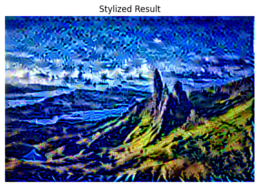

# 🎨 Neural Style Transfer – Task 05 (Prodigy Infotech Internship)

This project applies **Neural Style Transfer** to blend the content of one image with the style of another using TensorFlow and VGG19.

---

## 📌 Objective

Apply the artistic style of one image (e.g., a painting) to the content of another (e.g., a landscape photo) using deep learning.

---

## 🧠 Technologies Used

- Python
- TensorFlow (eager execution mode)
- VGG19 pre-trained model
- Google Colab

---

## 🖼️ How It Works

1. **Upload Images**: Upload your content image and style image.
2. **Preprocessing**: Both images are resized and normalized.
3. **Feature Extraction**: VGG19 extracts content & style features.
4. **Optimization**: A generated image is trained to minimize content & style loss.
5. **Result**: Final stylized image is saved and displayed.

---

## 📁 Project Structure

📦 NeuralStyleTransfer/
1) stylized.png # Final output image
2) content.jpg # Uploaded content image
3) style.jpg # Uploaded style image
4) neural_style_transfer.ipynb # Colab notebook
5) README.md

---

## 🚀 How to Use (in Google Colab)

1. Open the notebook in [Google Colab](https://colab.research.google.com/).
2. Upload your `content.jpg` and `style.jpg`.
3. Run all cells.
4. The final image will be saved as `stylized.jpg`.

---

## 📸 Example Output

---

## ✅ Status

✔️ Completed successfully  
✔️ Tested in Google Colab  
✔️ Handles eager execution and TensorFlow compatibility

---
